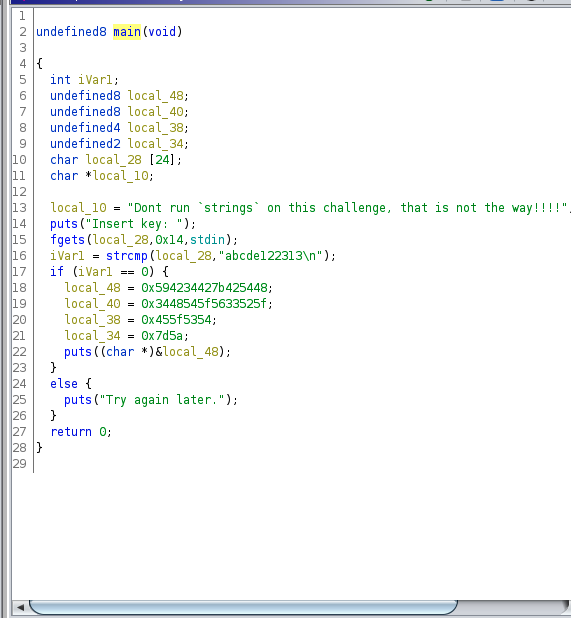

# Hack the Box Reverse Engineering: Baby-re

As I learn about reverse engineering and hacking, I find myself repeating certain
steps. When working on the network, I start with Nmap and when reverse engineering
I start with file.

```bash
file baby | tr "," "\n"
```

The next thing I did was execute the file. 

```bash
$ ./baby     
Insert key:
```

This is interesting and something to keep in mind as I look through the code.

I opened the file in ghidra and looked at the code. I found a function named main
and started there.



The first section is declaring variables and nothing too interesting. I see a
puts function call that asks for a key and a fgets that looks to assign standard
input to one of the variables. Next, strcmp looks like a string comparison from
what I can tell and the value is assigned and compared in the if statement.
It looks like if the input from the user matches `abcde122313\n` then something
is printed to the console with the puts function. If it is not equal to `abcde122313\n`
than puts prints out `Try again later.` and exits.

Well, alright then lets give it a shot. Lets execute the file and inter abcde122313
as the key.

```bash
./baby
Insert key:
abcde122313
HTB{B4BY_R3V_TH4TS_EZ}
```

That's it! We got the flag!

Download [baby](baby) and try it yourself.
